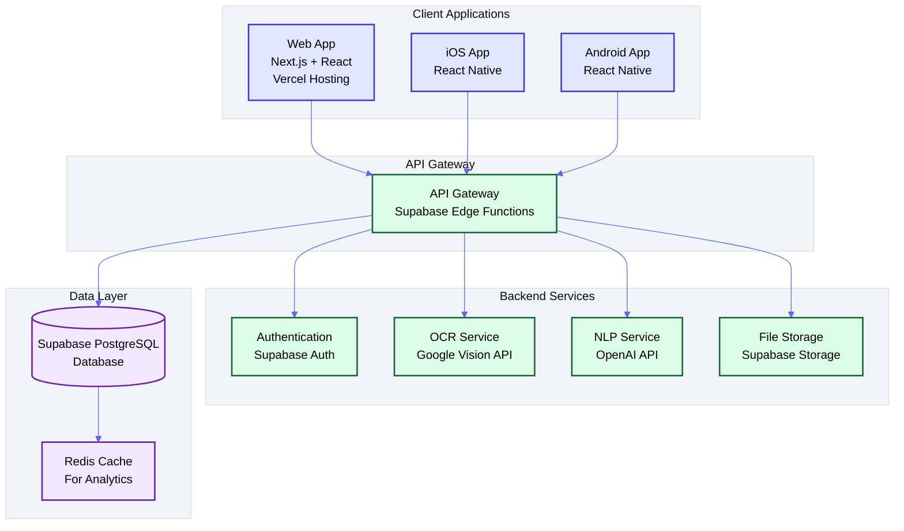
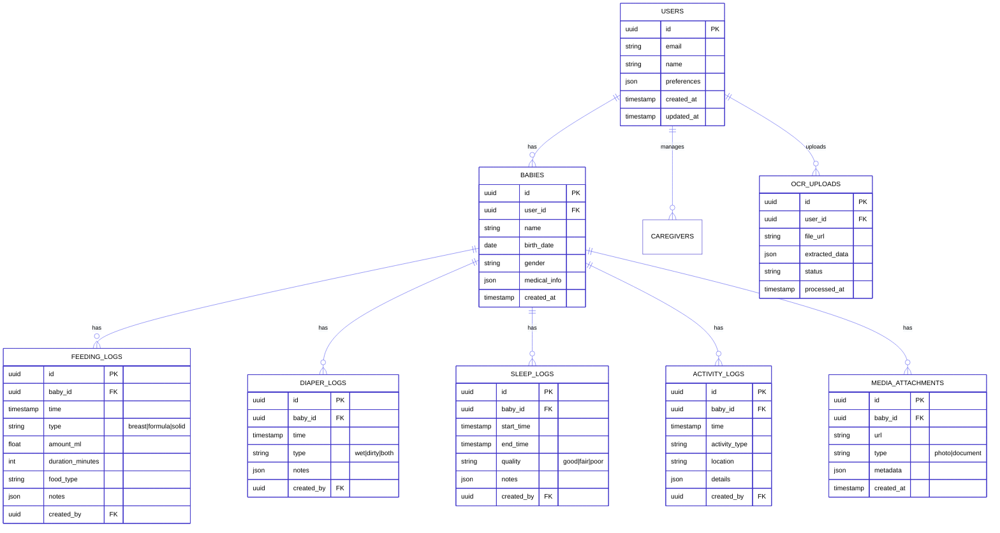
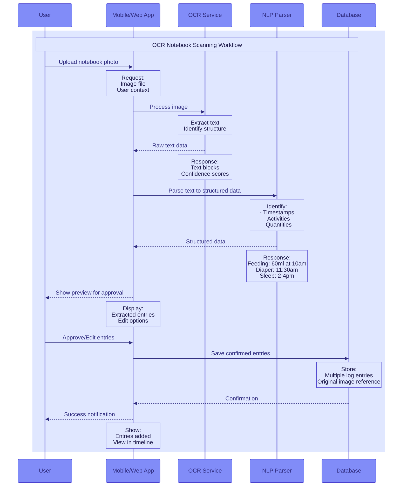
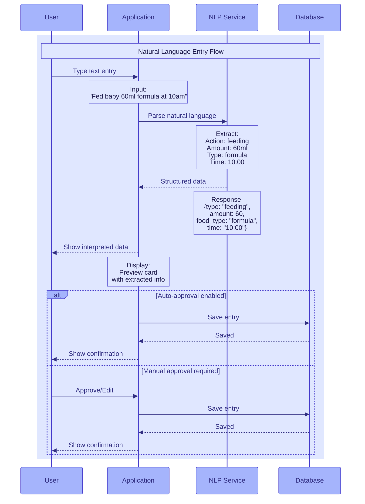
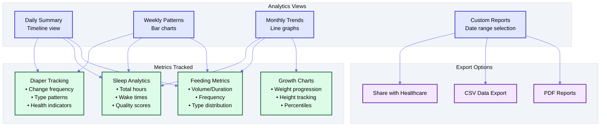

# Baby Tracker Application - Design Document

## 📋 Product Requirements

### Overview
A comprehensive baby tracking application that enables parents to monitor and analyze their baby's daily activities through multiple interfaces (Web, iOS, Android). The application features OCR scanning for digitizing handwritten notes, natural language processing for easy data entry, and analytics dashboards for pattern visualization.

### Core Features
1. **Activity Tracking**
   - Feeding (breast milk, formula, solid foods)
   - Diaper changes
   - Sleep patterns
   - Activities and milestones
   - Location tracking

2. **Data Entry Methods**
   - OCR scanning of handwritten notebooks
   - Natural language text input with AI parsing
   - Structured forms for manual entry
   - Voice input (future enhancement)

3. **Analytics & Insights**
   - Daily/weekly/monthly activity patterns
   - Growth charts
   - Feeding trends
   - Sleep analysis
   - Customizable reports

4. **Multi-Platform Support**
   - Responsive web application
   - Native iOS application
   - Native Android application
   - Real-time sync across all platforms

---

## 🏗️ System Architecture

### High-Level Architecture



### Technology Stack

#### Frontend
- **Web**: Next.js 14 (App Router), React 18, TypeScript, Tailwind CSS
- **Mobile**: React Native with Expo (unified codebase for iOS/Android)
- **State Management**: Zustand + React Query
- **UI Components**: shadcn/ui for web, React Native Elements for mobile
- **Charts**: Recharts (web), Victory Native (mobile)

#### Backend
- **Database**: Supabase (PostgreSQL)
- **Authentication**: Supabase Auth
- **File Storage**: Supabase Storage
- **Edge Functions**: Supabase Edge Functions (Deno)
- **OCR**: Google Cloud Vision API / Tesseract.js
- **NLP**: OpenAI GPT-4 API for text parsing
- **Real-time**: Supabase Realtime subscriptions

#### Infrastructure
- **Web Hosting**: Vercel
- **Mobile Distribution**: 
  - iOS: App Store Connect
  - Android: Google Play Console
- **CDN**: Cloudflare (for static assets)
- **Monitoring**: Sentry, Vercel Analytics
- **CI/CD**: GitHub Actions

---

## 📊 Database Schema



---

## 🔄 User Workflows

### 1. OCR Notebook Scanning Flow



### 2. Natural Language Input Flow



### 3. Analytics Dashboard Flow



---

## 🎨 UI/UX Design Principles

### Design System
- **Colors**: 
  - Primary: Indigo (#4F46E5)
  - Secondary: Purple (#9333EA)
  - Success: Green (#10B981)
  - Warning: Amber (#F59E0B)
  - Neutral: Slate grays

- **Typography**:
  - Headers: Inter (sans-serif)
  - Body: System fonts
  - Monospace: JetBrains Mono (for data)

- **Components**:
  - Card-based layouts
  - Timeline views for daily activities
  - Chart components for analytics
  - Modal dialogs for quick entry
  - Bottom sheets (mobile)
  - Floating action buttons

### Mobile-First Responsive Design
- Touch-optimized interfaces
- Swipe gestures for navigation
- Pull-to-refresh for data sync
- Offline-first architecture
- Progressive Web App capabilities

---

## 🚀 Implementation Phases

### Phase 1: MVP (Weeks 1-4)
- [ ] Basic authentication (Supabase Auth)
- [ ] Database schema setup
- [ ] Manual entry forms (feeding, diaper, sleep)
- [ ] Simple timeline view
- [ ] Web application deployment on Vercel

### Phase 2: Mobile Apps (Weeks 5-8)
- [ ] React Native setup with Expo
- [ ] Shared component library
- [ ] iOS app development
- [ ] Android app development
- [ ] Cross-platform data sync

### Phase 3: Advanced Features (Weeks 9-12)
- [ ] OCR integration
- [ ] Natural language processing
- [ ] Analytics dashboard
- [ ] Export functionality
- [ ] Push notifications

### Phase 4: Enhancement (Weeks 13-16)
- [ ] Voice input
- [ ] Healthcare provider sharing
- [ ] Multiple baby support
- [ ] Caregiver collaboration
- [ ] Advanced analytics & ML insights

---

## 🔐 Security & Privacy

### Data Protection
- End-to-end encryption for sensitive data
- HIPAA compliance considerations
- GDPR compliance for EU users
- Secure file storage with access controls
- Regular security audits

### Authentication & Authorization
- Multi-factor authentication
- Role-based access control (parents, caregivers)
- Session management
- Secure API endpoints
- Rate limiting

---

## 📱 Mobile Deployment Strategy

### iOS Deployment
- App Store Connect setup
- TestFlight for beta testing
- App Store optimization
- Push notification certificates

### Android Deployment
- Google Play Console setup
- Internal testing tracks
- Production rollout strategy
- Google Play optimization

### Updates & Maintenance
- Over-the-air updates (Expo)
- Version management
- Backward compatibility
- User migration strategies

---

## 🔄 API Design

### RESTful Endpoints

```yaml
Authentication:
  POST   /api/auth/register
  POST   /api/auth/login
  POST   /api/auth/logout
  POST   /api/auth/refresh

Babies:
  GET    /api/babies
  POST   /api/babies
  GET    /api/babies/{id}
  PUT    /api/babies/{id}
  DELETE /api/babies/{id}

Activity Logs:
  GET    /api/babies/{id}/feeding
  POST   /api/babies/{id}/feeding
  GET    /api/babies/{id}/diapers
  POST   /api/babies/{id}/diapers
  GET    /api/babies/{id}/sleep
  POST   /api/babies/{id}/sleep
  GET    /api/babies/{id}/activities
  POST   /api/babies/{id}/activities

Analytics:
  GET    /api/analytics/summary?baby_id={id}&period={daily|weekly|monthly}
  GET    /api/analytics/trends?baby_id={id}&metric={feeding|sleep|diapers}
  GET    /api/analytics/export?baby_id={id}&format={pdf|csv}

OCR & NLP:
  POST   /api/ocr/upload
  GET    /api/ocr/status/{job_id}
  POST   /api/nlp/parse
```

---

## 📈 Success Metrics

### Key Performance Indicators
- User retention rate (30-day, 90-day)
- Daily active users
- Average session duration
- Feature adoption rates
- Data entry frequency
- OCR accuracy rate
- NLP parsing accuracy

### User Satisfaction
- App store ratings
- User feedback surveys
- Feature request tracking
- Support ticket volume
- Time to resolution

---

## 🛠️ Development Tools

### Required Tools
- Node.js 20+
- pnpm (package manager)
- Git
- VS Code / Cursor
- Xcode (for iOS)
- Android Studio (for Android)
- Docker (optional)

### Development Environment
```bash
# Clone repository
git clone [repo-url]

# Install dependencies
pnpm install

# Setup environment variables
cp .env.example .env.local

# Run development servers
pnpm dev:web
pnpm dev:mobile
```

---

## 📝 Notes & Considerations

### Technical Debt Management
- Regular refactoring sprints
- Code review process
- Automated testing coverage
- Performance monitoring
- Dependency updates

### Scalability Planning
- Database indexing strategy
- CDN implementation
- API rate limiting
- Caching strategies
- Horizontal scaling preparation

### Future Enhancements
- AI-powered insights and predictions
- Wearable device integration
- Video monitoring integration
- Community features
- Telehealth integration
- Multi-language support

---

## 🤝 Team Collaboration

### Development Workflow
1. Feature branch creation
2. Incremental commits
3. Pull request with review
4. Automated testing
5. Staging deployment
6. Production release

### Communication Channels
- GitHub Issues for bug tracking
- GitHub Discussions for features
- Slack/Discord for real-time communication
- Weekly sync meetings
- Sprint planning sessions
