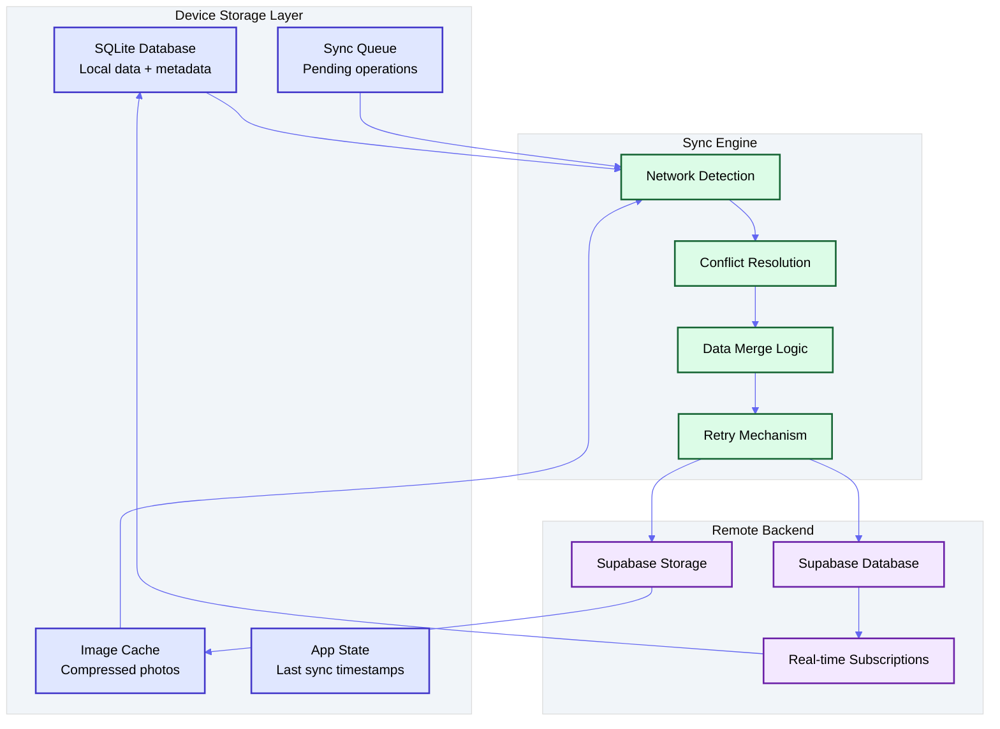
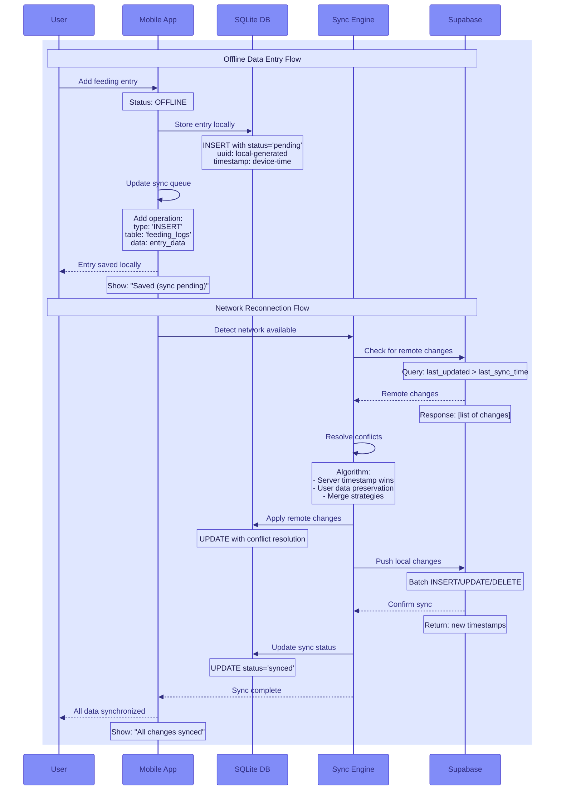

# Baby Tracker Application - Design Document

## 📋 Product Requirements

### Overview
A comprehensive baby tracking application that enables parents to monitor and analyze their baby's daily activities through multiple interfaces (Web, iOS, Android). The application features OCR scanning for digitizing handwritten notes, natural language processing for easy data entry, and analytics dashboards for pattern visualization.

### Core Features
1. **Activity Tracking**
   - Feeding (breast milk, formula, solid foods)
   - Diaper changes
   - Sleep patterns
   - Activities and milestones
   - Location tracking

2. **Data Entry Methods**
   - OCR scanning of handwritten notebooks
   - Natural language text input with AI parsing
   - Structured forms for manual entry
   - Voice input (future enhancement)

3. **Analytics & Insights**
   - Daily/weekly/monthly activity patterns
   - Growth charts
   - Feeding trends
   - Sleep analysis
   - Customizable reports

4. **Multi-Platform Support**
   - Responsive web application
   - Native iOS application
   - Native Android application
   - Real-time sync across all platforms

---

## 🏗️ System Architecture

### High-Level Architecture


### Technology Stack

#### Frontend
- **Web**: Next.js 14 (App Router), React 18, TypeScript, Tailwind CSS
- **Mobile**: React Native with Expo (unified codebase for iOS/Android)
- **State Management**: Zustand + React Query
- **UI Components**: shadcn/ui for web, React Native Elements for mobile
- **Charts**: Recharts (web), Victory Native (mobile)

#### Backend
- **Database**: Supabase (PostgreSQL)
- **Authentication**: Supabase Auth
- **File Storage**: Supabase Storage
- **Edge Functions**: Supabase Edge Functions (Deno)
- **OCR**: Google Cloud Vision API / Tesseract.js
- **NLP**: OpenAI GPT-4 API for text parsing
- **Real-time**: Supabase Realtime subscriptions

#### Infrastructure
- **Web Hosting**: Vercel
- **Mobile Distribution**: 
  - iOS: App Store Connect
  - Android: Google Play Console
- **CDN**: Cloudflare (for static assets)
- **Monitoring**: Sentry, Vercel Analytics
- **CI/CD**: GitHub Actions

---

## 📊 Database Schema


---

## 🔄 User Workflows

### 1. OCR Notebook Scanning Flow


### 2. Natural Language Input Flow


### 3. Analytics Dashboard Flow

```mermaid
%%{init: {
  'theme': 'base',
  'themeVariables': {
    'primaryColor': '#4F46E5',
    'primaryTextColor': '#000000',
    'primaryBorderColor': '#4338CA',
    'lineColor': '#6366F1',
    'secondaryColor': '#E2E8F0',
    'tertiaryColor': '#F1F5F9',
    'textColor': '#000000',
    'mainBkg': '#ffffff'
  }
}}%%
graph TB
    subgraph "Analytics Views"
        Daily["Daily Summary<br>Timeline view"]
        Weekly["Weekly Patterns<br>Bar charts"]
        Monthly["Monthly Trends<br>Line graphs"]
        Custom["Custom Reports<br>Date range selection"]
    end
    
    subgraph "Metrics Tracked"
        Feed["Feeding Metrics<br>• Volume/Duration<br>• Frequency<br>• Type distribution"]
        Sleep["Sleep Analytics<br>• Total hours<br>• Wake times<br>• Quality scores"]
        Diaper["Diaper Tracking<br>• Change frequency<br>• Type patterns<br>• Health indicators"]
        Growth["Growth Charts<br>• Weight progression<br>• Height tracking<br>• Percentiles"]
    end
    
    subgraph "Export Options"
        PDF["PDF Reports"]
        CSV["CSV Data Export"]
        Share["Share with Healthcare"]
    end
    
    Daily --> Feed
    Daily --> Sleep
    Daily --> Diaper
    
    Weekly --> Feed
    Weekly --> Sleep
    Weekly --> Diaper
    
    Monthly --> Growth
    Monthly --> Feed
    Monthly --> Sleep
    
    Custom --> PDF
    Custom --> CSV
    Custom --> Share

    classDef default fill:#F8FAFC,stroke:#475569,stroke-width:2px
    classDef view fill:#E0E7FF,stroke:#4338CA,stroke-width:2px
    classDef metric fill:#DCFCE7,stroke:#166534,stroke-width:2px
    classDef export fill:#F3E8FF,stroke:#6B21A8,stroke-width:2px
    
    class Daily,Weekly,Monthly,Custom view
    class Feed,Sleep,Diaper,Growth metric
    class PDF,CSV,Share export
```



---

## 📱 Offline Support Architecture

### Overview
The Baby Tracker application must function seamlessly even without network connectivity, as parents often need to log activities in areas with poor reception or to preserve device battery by keeping network off.

### Offline-First Design Principles

#### 1. Local-First Data Storage
- **SQLite Local Database**: Each device maintains a complete local copy of user data
- **Conflict-Free Replicated Data Types (CRDTs)**: For handling concurrent edits
- **Event Sourcing**: Track all changes as events for reliable synchronization

#### 2. Offline Data Architecture



### Offline Data Synchronization Flow



### Conflict Resolution Strategy

#### 1. **Timestamp-Based Resolution**
```typescript
interface SyncMetadata {
  created_at: string;      // Device timestamp
  server_created_at?: string; // Server timestamp
  updated_at: string;      // Last local update
  server_updated_at?: string; // Last server update
  device_id: string;       // Unique device identifier
  sync_version: number;    // Optimistic concurrency
}
```

#### 2. **Conflict Types & Resolutions**
- **Create-Create Conflicts**: Keep both, merge if possible
- **Update-Update Conflicts**: Server timestamp wins, preserve user intent
- **Create-Delete Conflicts**: Restore if recently deleted
- **Field-Level Conflicts**: Merge non-conflicting fields

#### 3. **User-Friendly Conflict UI**
```typescript
interface ConflictResolution {
  type: 'feeding_conflict' | 'diaper_conflict' | 'sleep_conflict';
  local_version: any;
  remote_version: any;
  suggested_resolution: any;
  user_choice?: 'local' | 'remote' | 'merge' | 'custom';
}
```

### Offline Storage Implementation

#### 1. **SQLite Schema Enhancement**
```sql
-- Add offline support columns to all tables
ALTER TABLE feeding_logs ADD COLUMN sync_status TEXT DEFAULT 'synced';
ALTER TABLE feeding_logs ADD COLUMN device_id TEXT;
ALTER TABLE feeding_logs ADD COLUMN local_id TEXT;
ALTER TABLE feeding_logs ADD COLUMN sync_version INTEGER DEFAULT 1;
ALTER TABLE feeding_logs ADD COLUMN conflict_data JSONB;

-- Sync queue table
CREATE TABLE sync_queue (
  id TEXT PRIMARY KEY,
  operation_type TEXT NOT NULL, -- 'insert', 'update', 'delete'
  table_name TEXT NOT NULL,
  record_id TEXT NOT NULL,
  data JSONB NOT NULL,
  retry_count INTEGER DEFAULT 0,
  created_at TIMESTAMP DEFAULT CURRENT_TIMESTAMP,
  status TEXT DEFAULT 'pending' -- 'pending', 'processing', 'failed', 'completed'
);

-- Sync metadata table
CREATE TABLE sync_metadata (
  table_name TEXT PRIMARY KEY,
  last_sync_timestamp TIMESTAMP,
  last_pull_timestamp TIMESTAMP,
  pending_operations INTEGER DEFAULT 0
);
```

#### 2. **Data Access Layer**
```typescript
class OfflineDataManager {
  private db: SQLiteDatabase;
  
  async saveEntry(entry: FeedingLog): Promise<void> {
    const localId = generateUUID();
    const entryWithMeta = {
      ...entry,
      local_id: localId,
      sync_status: 'pending',
      device_id: getDeviceId()
    };
    
    // Save to local DB
    await this.db.insert('feeding_logs', entryWithMeta);
    
    // Add to sync queue
    await this.addToSyncQueue('insert', 'feeding_logs', localId, entryWithMeta);
    
    // Trigger sync if online
    if (await this.isOnline()) {
      this.syncManager.enqueueSyncOperation();
    }
  }
}
```

### Offline Media Handling

#### 1. **Image Compression & Storage**
- **Aggressive Compression**: Reduce image sizes for offline storage
- **Progressive Sync**: Sync thumbnails first, full images later
- **Cache Management**: Intelligent cleanup based on storage limits

#### 2. **OCR Offline Processing**
```typescript
class OfflineOCRProcessor {
  async processImageOffline(imageUri: string): Promise<ExtractedData> {
    // Use Tesseract.js for offline OCR
    const { data: { text } } = await recognize(imageUri, 'eng');
    
    // Basic parsing without AI
    const entries = this.parseTextBasic(text);
    
    // Save for AI processing when online
    await this.queueForAIProcessing(imageUri, text);
    
    return { entries, confidence: 0.7, requires_review: true };
  }
}
```

### Offline UX Patterns

#### 1. **Status Indicators**
- **Sync Status Badge**: Shows pending/synced/error states
- **Data Freshness**: Last sync timestamp display
- **Offline Mode Banner**: Clear offline state indication

#### 2. **Progressive Disclosure**
```typescript
interface SyncStatus {
  isOnline: boolean;
  pendingOperations: number;
  lastSync: Date;
  syncInProgress: boolean;
  conflictsToResolve: number;
}
```

#### 3. **Graceful Degradation**
- **Read-Only Analytics**: Show cached data with disclaimers
- **Essential Functions Only**: Prioritize core logging features
- **Queue Status**: Show what's waiting to sync

### Implementation Priorities

#### Phase 1: Basic Offline Support
- [ ] SQLite integration
- [ ] Local data storage
- [ ] Basic sync queue
- [ ] Network detection

#### Phase 2: Conflict Resolution
- [ ] Conflict detection
- [ ] Resolution strategies
- [ ] User conflict UI
- [ ] Data integrity checks

#### Phase 3: Advanced Features
- [ ] Offline OCR processing
- [ ] Image compression
- [ ] Smart sync scheduling
- [ ] Bandwidth optimization

---

## 🎨 UI/UX Design Principles

### Design System
- **Colors**: 
  - Primary: Indigo (#4F46E5)
  - Secondary: Purple (#9333EA)
  - Success: Green (#10B981)
  - Warning: Amber (#F59E0B)
  - Neutral: Slate grays

- **Typography**:
  - Headers: Inter (sans-serif)
  - Body: System fonts
  - Monospace: JetBrains Mono (for data)

- **Components**:
  - Card-based layouts
  - Timeline views for daily activities
  - Chart components for analytics
  - Modal dialogs for quick entry
  - Bottom sheets (mobile)
  - Floating action buttons

### Mobile-First Responsive Design
- Touch-optimized interfaces
- Swipe gestures for navigation
- Pull-to-refresh for data sync
- Offline-first architecture
- Progressive Web App capabilities

---

## 🚀 Implementation Phases

### Phase 1: MVP (Weeks 1-4)
- [ ] Basic authentication (Supabase Auth)
- [ ] Database schema setup
- [ ] Manual entry forms (feeding, diaper, sleep)
- [ ] Simple timeline view
- [ ] Web application deployment on Vercel

### Phase 2: Mobile Apps (Weeks 5-8)
- [ ] React Native setup with Expo
- [ ] Shared component library
- [ ] iOS app development
- [ ] Android app development
- [ ] Cross-platform data sync

### Phase 3: Advanced Features (Weeks 9-12)
- [ ] OCR integration
- [ ] Natural language processing
- [ ] Analytics dashboard
- [ ] Export functionality
- [ ] Push notifications

### Phase 4: Enhancement (Weeks 13-16)
- [ ] Voice input
- [ ] Healthcare provider sharing
- [ ] Multiple baby support
- [ ] Caregiver collaboration
- [ ] Advanced analytics & ML insights

---

## 🔐 Security & Privacy

### Data Protection
- End-to-end encryption for sensitive data
- HIPAA compliance considerations
- GDPR compliance for EU users
- Secure file storage with access controls
- Regular security audits

### Authentication & Authorization
- Multi-factor authentication
- Role-based access control (parents, caregivers)
- Session management
- Secure API endpoints
- Rate limiting

---

## 📱 Mobile Deployment Strategy

### iOS Deployment
- App Store Connect setup
- TestFlight for beta testing
- App Store optimization
- Push notification certificates

### Android Deployment
- Google Play Console setup
- Internal testing tracks
- Production rollout strategy
- Google Play optimization

### Updates & Maintenance
- Over-the-air updates (Expo)
- Version management
- Backward compatibility
- User migration strategies

---

## 🔄 API Design

### RESTful Endpoints

```yaml
Authentication:
  POST   /api/auth/register
  POST   /api/auth/login
  POST   /api/auth/logout
  POST   /api/auth/refresh

Babies:
  GET    /api/babies
  POST   /api/babies
  GET    /api/babies/{id}
  PUT    /api/babies/{id}
  DELETE /api/babies/{id}

Activity Logs:
  GET    /api/babies/{id}/feeding
  POST   /api/babies/{id}/feeding
  GET    /api/babies/{id}/diapers
  POST   /api/babies/{id}/diapers
  GET    /api/babies/{id}/sleep
  POST   /api/babies/{id}/sleep
  GET    /api/babies/{id}/activities
  POST   /api/babies/{id}/activities

Analytics:
  GET    /api/analytics/summary?baby_id={id}&period={daily|weekly|monthly}
  GET    /api/analytics/trends?baby_id={id}&metric={feeding|sleep|diapers}
  GET    /api/analytics/export?baby_id={id}&format={pdf|csv}

OCR & NLP:
  POST   /api/ocr/upload
  GET    /api/ocr/status/{job_id}
  POST   /api/nlp/parse
```

---

## 📈 Success Metrics

### Key Performance Indicators
- User retention rate (30-day, 90-day)
- Daily active users
- Average session duration
- Feature adoption rates
- Data entry frequency
- OCR accuracy rate
- NLP parsing accuracy

### User Satisfaction
- App store ratings
- User feedback surveys
- Feature request tracking
- Support ticket volume
- Time to resolution

---

## 🛠️ Development Tools

### Required Tools
- Node.js 20+
- pnpm (package manager)
- Git
- VS Code / Cursor
- Xcode (for iOS)
- Android Studio (for Android)
- Docker (optional)

### Development Environment
```bash
# Clone repository
git clone [repo-url]

# Install dependencies
pnpm install

# Setup environment variables
cp .env.example .env.local

# Run development servers
pnpm dev:web
pnpm dev:mobile
```

---

## 📝 Notes & Considerations

### Technical Debt Management
- Regular refactoring sprints
- Code review process
- Automated testing coverage
- Performance monitoring
- Dependency updates

### Scalability Planning
- Database indexing strategy
- CDN implementation
- API rate limiting
- Caching strategies
- Horizontal scaling preparation

### Future Enhancements
- AI-powered insights and predictions
- Wearable device integration
- Video monitoring integration
- Community features
- Telehealth integration
- Multi-language support

---

## 🤝 Team Collaboration

### Development Workflow
1. Feature branch creation
2. Incremental commits
3. Pull request with review
4. Automated testing
5. Staging deployment
6. Production release

### Communication Channels
- GitHub Issues for bug tracking
- GitHub Discussions for features
- Slack/Discord for real-time communication
- Weekly sync meetings
- Sprint planning sessions
