# Implementation Plan - Baby Tracker Application

## 📋 Executive Summary

This document provides a comprehensive implementation plan for the Baby Tracker application, breaking down features into manageable components with clear dependencies, priorities, and sequencing. The plan follows agile project management methodologies with P0-P3 priority levels and enables concurrent development across multiple teams.

---

## 🎯 Feature Dependency Graph

### Core System Dependencies

```mermaid
%%{init: {
  'theme': 'base',
  'themeVariables': {
    'primaryColor': '#4F46E5',
    'primaryTextColor': '#000000',
    'primaryBorderColor': '#4338CA',
    'lineColor': '#6366F1',
    'secondaryColor': '#E2E8F0',
    'tertiaryColor': '#F1F5F9',
    'textColor': '#000000',
    'mainBkg': '#ffffff'
  }
}}%%
graph TB
    subgraph "P0 - Foundation Layer"
        Auth["F001: Authentication<br>• User registration<br>• Login/logout<br>• Session management"]
        Database["F002: Database Schema<br>• Supabase setup<br>• Table creation<br>• RLS policies"]
        Types["F003: Shared Types<br>• TypeScript interfaces<br>• API contracts<br>• Validation schemas"]
    end

    subgraph "P0 - Core Data Layer"
        BabyMgmt["F004: Baby Management<br>• Create/edit profiles<br>• Multiple babies<br>• Basic info storage"]
        LocalDB["F005: Local Storage<br>• SQLite integration<br>• Offline-first<br>• Sync infrastructure"]
    end

    subgraph "P0 - Basic Logging"
        FeedingBasic["F006: Feeding Entry<br>• Manual forms<br>• Basic validation<br>• Local storage"]
        DiaperBasic["F007: Diaper Entry<br>• Manual forms<br>• Basic validation<br>• Local storage"]
        SleepBasic["F008: Sleep Entry<br>• Manual forms<br>• Basic validation<br>• Local storage"]
    end

    subgraph "P1 - Mobile Foundation"
        ReactNative["F009: React Native Setup<br>• Expo configuration<br>• Navigation<br>• Platform-specific code"]
        SharedUI["F010: UI Components<br>• Design system<br>• Shared components<br>• Platform adaptation"]
    end

    subgraph "P1 - Core Features"
        Timeline["F011: Activity Timeline<br>• Daily view<br>• Entry display<br>• Filtering/search"]
        Sync["F012: Data Synchronization<br>• Real-time sync<br>• Conflict resolution<br>• Offline queue"]
        MediaMgmt["F013: Media Management<br>• Photo upload<br>• Storage integration<br>• Compression"]
    end

    subgraph "P2 - AI Features"
        OCR["F014: OCR Integration<br>• Google Vision API<br>• Tesseract.js fallback<br>• Image preprocessing"]
        NLP["F015: NLP Processing<br>• OpenAI integration<br>• Text parsing<br>• Structured output"]
        SmartEntry["F016: Smart Entry<br>• Natural language input<br>• Auto-categorization<br>• Approval workflow"]
    end

    subgraph "P2 - Analytics & Insights"
        BasicAnalytics["F017: Basic Analytics<br>• Daily summaries<br>• Simple charts<br>• Trend indicators"]
        Dashboard["F018: Analytics Dashboard<br>• Interactive charts<br>• Custom date ranges<br>• Export functionality"]
        Insights["F019: AI Insights<br>• Pattern recognition<br>• Health indicators<br>• Recommendations"]
    end

    subgraph "P3 - Advanced Features"
        Notifications["F020: Notifications<br>• Push notifications<br>• Reminders<br>• Schedule alerts"]
        Sharing["F021: Data Sharing<br>• Healthcare providers<br>• Family members<br>• Export formats"]
        Advanced["F022: Advanced Features<br>• Voice input<br>• Wearable integration<br>• Telemedicine"]
    end

    %% Dependencies
    Auth --> BabyMgmt
    Database --> Auth
    Database --> BabyMgmt
    Types --> Auth
    Types --> Database
    
    BabyMgmt --> FeedingBasic
    BabyMgmt --> DiaperBasic
    BabyMgmt --> SleepBasic
    LocalDB --> FeedingBasic
    LocalDB --> DiaperBasic
    LocalDB --> SleepBasic
    
    FeedingBasic --> Timeline
    DiaperBasic --> Timeline
    SleepBasic --> Timeline
    LocalDB --> Sync
    
    ReactNative --> SharedUI
    SharedUI --> Timeline
    SharedUI --> Sync
    
    Timeline --> BasicAnalytics
    Sync --> OCR
    Sync --> NLP
    MediaMgmt --> OCR
    
    OCR --> SmartEntry
    NLP --> SmartEntry
    BasicAnalytics --> Dashboard
    Dashboard --> Insights
    
    Sync --> Notifications
    Dashboard --> Sharing
    Insights --> Advanced

    classDef p0 fill:#DC2626,stroke:#B91C1C,stroke-width:2px,color:#FFFFFF
    classDef p1 fill:#EA580C,stroke:#C2410C,stroke-width:2px,color:#FFFFFF
    classDef p2 fill:#CA8A04,stroke:#A16207,stroke-width:2px,color:#FFFFFF
    classDef p3 fill:#16A34A,stroke:#15803D,stroke-width:2px,color:#FFFFFF
    
    class Auth,Database,Types,BabyMgmt,LocalDB,FeedingBasic,DiaperBasic,SleepBasic p0
    class ReactNative,SharedUI,Timeline,Sync,MediaMgmt p1
    class OCR,NLP,SmartEntry,BasicAnalytics,Dashboard,Insights p2
    class Notifications,Sharing,Advanced p3
```



### Platform-Specific Implementation Flow

```mermaid
%%{init: {
  'theme': 'base',
  'themeVariables': {
    'primaryColor': '#4F46E5',
    'primaryTextColor': '#000000',
    'primaryBorderColor': '#4338CA',
    'lineColor': '#6366F1',
    'secondaryColor': '#E2E8F0',
    'tertiaryColor': '#F1F5F9',
    'textColor': '#000000',
    'mainBkg': '#ffffff'
  }
}}%%
graph LR
    subgraph "Phase 1: Foundation (Weeks 1-4)"
        P1_Backend["Backend Setup<br>• Supabase config<br>• Database schema<br>• Authentication"]
        P1_Web["Web MVP<br>• Next.js setup<br>• Basic forms<br>• Authentication"]
        P1_Shared["Shared Library<br>• Types definition<br>• Utilities<br>• Validation"]
    end

    subgraph "Phase 2: Mobile Core (Weeks 5-8)"
        P2_RN["React Native Setup<br>• Expo configuration<br>• Navigation<br>• State management"]
        P2_Offline["Offline Infrastructure<br>• SQLite integration<br>• Sync engine<br>• Network detection"]
        P2_UI["UI Components<br>• Design system<br>• Forms<br>• Timeline view"]
    end

    subgraph "Phase 3: AI Integration (Weeks 9-12)"
        P3_OCR["OCR Processing<br>• Google Vision API<br>• Tesseract.js<br>• Image handling"]
        P3_NLP["NLP Processing<br>• OpenAI integration<br>• Text parsing<br>• Smart entry"]
        P3_Analytics["Analytics Core<br>• Data aggregation<br>• Chart components<br>• Export features"]
    end

    subgraph "Phase 4: Polish & Deploy (Weeks 13-16)"
        P4_Advanced["Advanced Features<br>• Notifications<br>• Sharing<br>• Performance tuning"]
        P4_Deploy["Deployment<br>• App store submission<br>• Production setup<br>• Monitoring"]
        P4_Test["Testing & QA<br>• E2E testing<br>• Performance testing<br>• Security audit"]
    end

    P1_Shared --> P1_Backend
    P1_Shared --> P1_Web
    P1_Backend --> P2_RN
    P1_Web --> P2_UI
    
    P2_RN --> P2_Offline
    P2_UI --> P2_Offline
    P2_Offline --> P3_OCR
    
    P3_OCR --> P3_NLP
    P3_NLP --> P3_Analytics
    P3_Analytics --> P4_Advanced
    
    P4_Advanced --> P4_Deploy
    P4_Deploy --> P4_Test

    classDef phase1 fill:#EF4444,stroke:#DC2626,stroke-width:2px,color:#FFFFFF
    classDef phase2 fill:#F97316,stroke:#EA580C,stroke-width:2px,color:#FFFFFF
    classDef phase3 fill:#EAB308,stroke:#CA8A04,stroke-width:2px,color:#FFFFFF
    classDef phase4 fill:#22C55E,stroke:#16A34A,stroke-width:2px,color:#FFFFFF
    
    class P1_Backend,P1_Web,P1_Shared phase1
    class P2_RN,P2_Offline,P2_UI phase2
    class P3_OCR,P3_NLP,P3_Analytics phase3
    class P4_Advanced,P4_Deploy,P4_Test phase4
```



---

## 📊 Detailed Feature Breakdown

### Priority Matrix

| Priority | Description | Timeline | Risk Level | Dependencies |
|----------|------------|----------|------------|--------------|
| **P0** | Critical - App cannot function without | Week 1-4 | Low | None |
| **P1** | High - Core user experience | Week 5-8 | Medium | P0 complete |
| **P2** | Medium - Value-add features | Week 9-12 | Medium-High | P0, P1 complete |
| **P3** | Low - Nice-to-have features | Week 13+ | High | P0, P1, P2 complete |

### P0 Features - Foundation (Weeks 1-4)

#### F001: Authentication System
**Priority**: P0 | **Effort**: 8 story points | **Team**: Backend + Web

**User Stories**:
- As a parent, I can create an account with email/password
- As a user, I can log in securely to access my data
- As a user, I can reset my password if forgotten
- As a user, I can log out to secure my account

**Technical Tasks**:
- [ ] Set up Supabase Auth configuration
- [ ] Implement email/password authentication
- [ ] Create user registration flow (web)
- [ ] Implement login/logout functionality
- [ ] Add password reset functionality
- [ ] Set up session management
- [ ] Add basic user profile management
- [ ] Implement auth guards/middleware

**Acceptance Criteria**:
- User can register with valid email/password
- User receives email verification
- Login/logout works across sessions
- Password reset flow is functional
- Auth state persists across page reloads

**Dependencies**: Database Schema (F002)
**Blocks**: All user-specific features

---

#### F002: Database Schema & Backend Setup
**Priority**: P0 | **Effort**: 12 story points | **Team**: Backend

**User Stories**:
- As a system, I need secure data storage for all baby tracking data
- As a developer, I need well-defined database schemas
- As a user, I need my data to be private and secure

**Technical Tasks**:
- [ ] Create Supabase project and configure
- [ ] Run initial database migrations
- [ ] Set up Row Level Security (RLS) policies
- [ ] Create database indexes for performance
- [ ] Set up Edge Functions for custom logic
- [ ] Configure Storage buckets for media
- [ ] Set up real-time subscriptions
- [ ] Add database backup strategy

**Acceptance Criteria**:
- All tables created with proper relationships
- RLS policies prevent unauthorized data access
- Database performance meets requirements
- Storage buckets configured with proper permissions
- Real-time subscriptions work correctly

**Dependencies**: None (Foundation)
**Blocks**: All features requiring data persistence

---

#### F003: Shared Types & Utilities
**Priority**: P0 | **Effort**: 5 story points | **Team**: Full-stack

**User Stories**:
- As a developer, I need consistent data types across platforms
- As a system, I need validated data contracts
- As a team, I need shared utility functions

**Technical Tasks**:
- [ ] Define TypeScript interfaces for all data models
- [ ] Create Zod validation schemas
- [ ] Set up shared utility functions
- [ ] Configure package build system
- [ ] Add comprehensive type documentation
- [ ] Set up import/export structure
- [ ] Create date/time utilities
- [ ] Add data transformation helpers

**Acceptance Criteria**:
- Types are consistently used across web/mobile
- Validation schemas prevent invalid data
- Shared utilities reduce code duplication
- Package exports work correctly

**Dependencies**: None (Foundation)
**Blocks**: All features requiring type safety

---

#### F004: Baby Profile Management
**Priority**: P0 | **Effort**: 10 story points | **Team**: Full-stack

**User Stories**:
- As a parent, I can create a profile for my baby
- As a parent, I can edit baby information
- As a parent, I can manage multiple babies
- As a parent, I can upload a baby photo

**Technical Tasks**:
- [ ] Create baby profile forms (web)
- [ ] Implement CRUD operations for babies
- [ ] Add photo upload functionality
- [ ] Set up data validation
- [ ] Create baby selection interface
- [ ] Add medical information fields
- [ ] Implement soft delete functionality
- [ ] Add baby profile export

**Acceptance Criteria**:
- User can create/edit/delete baby profiles
- Photo upload works with compression
- Multiple babies are properly managed
- Medical information is securely stored
- Data validation prevents invalid entries

**Dependencies**: Authentication (F001), Database (F002), Types (F003)
**Blocks**: All baby-specific logging features

---

#### F005: Local Storage & Offline Foundation
**Priority**: P0 | **Effort**: 15 story points | **Team**: Mobile + Backend

**User Stories**:
- As a parent, I can use the app without internet connection
- As a user, my data syncs when I'm back online
- As a parent, I don't lose data due to connectivity issues

**Technical Tasks**:
- [ ] Set up SQLite database for mobile
- [ ] Create local storage layer abstraction
- [ ] Implement basic sync queue
- [ ] Add network connectivity detection
- [ ] Create data migration system
- [ ] Set up conflict resolution foundation
- [ ] Add offline data validation
- [ ] Implement cache management

**Acceptance Criteria**:
- App works completely offline
- Data persists locally between sessions
- Basic sync functionality works when online
- Network state is properly detected
- Local data integrity is maintained

**Dependencies**: Database Schema (F002), Types (F003)
**Blocks**: All offline functionality

---

#### F006-F008: Basic Logging (Feeding, Diaper, Sleep)
**Priority**: P0 | **Effort**: 20 story points | **Team**: Full-stack

**User Stories**:
- As a parent, I can log feeding sessions with amount and type
- As a parent, I can log diaper changes with details
- As a parent, I can log sleep sessions with duration
- As a parent, I can edit or delete log entries

**Technical Tasks**:
- [ ] Create feeding entry forms with validation
- [ ] Create diaper change forms with options
- [ ] Create sleep tracking with start/end times
- [ ] Implement local data persistence
- [ ] Add form validation and error handling
- [ ] Create edit/delete functionality
- [ ] Add quick entry shortcuts
- [ ] Implement data export functionality

**Acceptance Criteria**:
- All entry types can be logged accurately
- Forms are validated and user-friendly
- Data persists locally and syncs when online
- Users can edit/delete their entries
- Quick entry options save time

**Dependencies**: Baby Management (F004), Local Storage (F005)
**Blocks**: Timeline (F011), Analytics (F017)

---

### P1 Features - Core Experience (Weeks 5-8)

#### F009: React Native & Mobile Foundation
**Priority**: P1 | **Effort**: 12 story points | **Team**: Mobile

**User Stories**:
- As a parent, I can access the app on my iPhone and Android
- As a user, I have a native mobile experience
- As a user, navigation is intuitive and fast

**Technical Tasks**:
- [ ] Set up Expo development environment
- [ ] Configure navigation stack
- [ ] Implement tab-based navigation
- [ ] Set up platform-specific code handling
- [ ] Configure build system for iOS/Android
- [ ] Add splash screen and app icons
- [ ] Set up deep linking
- [ ] Configure app permissions (camera, storage)

**Acceptance Criteria**:
- App builds successfully on iOS and Android
- Navigation works smoothly across screens
- Platform-specific features work correctly
- App icons and splash screens display properly
- Required permissions are properly requested

**Dependencies**: P0 features complete
**Blocks**: Mobile-specific features

---

#### F010: Shared UI Components & Design System
**Priority**: P1 | **Effort**: 15 story points | **Team**: Frontend

**User Stories**:
- As a user, I have a consistent experience across platforms
- As a developer, I can reuse components efficiently
- As a user, the interface is intuitive and accessible

**Technical Tasks**:
- [ ] Create design system with tokens
- [ ] Build shared component library
- [ ] Implement responsive design patterns
- [ ] Add accessibility features
- [ ] Create platform-specific adaptations
- [ ] Set up Storybook documentation
- [ ] Add dark mode support
- [ ] Implement theming system

**Acceptance Criteria**:
- Components work consistently on web and mobile
- Design system is well-documented
- Accessibility standards are met
- Dark mode toggles work properly
- Responsive design works on all screen sizes

**Dependencies**: React Native setup (F009)
**Blocks**: All UI-heavy features

---

#### F011: Activity Timeline & History
**Priority**: P1 | **Effort**: 12 story points | **Team**: Full-stack

**User Stories**:
- As a parent, I can see all my baby's activities in chronological order
- As a parent, I can filter activities by type and date
- As a parent, I can search through historical entries
- As a parent, I can see daily summaries

**Technical Tasks**:
- [ ] Create timeline view component
- [ ] Implement infinite scroll/pagination
- [ ] Add filtering and search functionality
- [ ] Create daily summary cards
- [ ] Add data loading states
- [ ] Implement pull-to-refresh
- [ ] Add empty states and error handling
- [ ] Create entry quick actions (edit/delete)

**Acceptance Criteria**:
- Timeline displays all activities chronologically
- Filtering and search work accurately
- Performance is good with large datasets
- Daily summaries are accurate
- User interactions are responsive

**Dependencies**: Basic logging (F006-F008), UI Components (F010)
**Blocks**: Analytics features

---

#### F012: Data Synchronization Engine
**Priority**: P1 | **Effort**: 18 story points | **Team**: Backend + Mobile

**User Stories**:
- As a parent, my data automatically syncs across all my devices
- As a user, I can see when data is syncing or if there are conflicts
- As a parent, I don't lose data when switching devices

**Technical Tasks**:
- [ ] Implement real-time sync with Supabase
- [ ] Create conflict resolution algorithms
- [ ] Add sync status indicators
- [ ] Implement retry mechanisms
- [ ] Add batch sync operations
- [ ] Create sync conflict UI
- [ ] Add manual sync triggers
- [ ] Implement sync health monitoring

**Acceptance Criteria**:
- Data syncs automatically when online
- Conflicts are resolved intelligently
- Users are informed of sync status
- Manual sync works when needed
- No data loss occurs during sync

**Dependencies**: Local Storage (F005), Timeline (F011)
**Blocks**: Real-time features

---

#### F013: Media Management
**Priority**: P1 | **Effort**: 10 story points | **Team**: Full-stack

**User Stories**:
- As a parent, I can attach photos to log entries
- As a parent, I can upload photos of notebooks for OCR
- As a user, photos are compressed and stored efficiently

**Technical Tasks**:
- [ ] Implement photo capture/selection
- [ ] Add image compression and resizing
- [ ] Create media upload pipeline
- [ ] Set up Supabase Storage integration
- [ ] Add image thumbnail generation
- [ ] Create media gallery view
- [ ] Implement media deletion
- [ ] Add offline media handling

**Acceptance Criteria**:
- Photos can be attached to entries
- Images are properly compressed
- Upload works reliably
- Thumbnails are generated correctly
- Media works offline and syncs later

**Dependencies**: UI Components (F010), Data Sync (F012)
**Blocks**: OCR functionality

---

### P2 Features - Value-Add (Weeks 9-12)

#### F014: OCR Integration
**Priority**: P2 | **Effort**: 15 story points | **Team**: Backend + Mobile

**User Stories**:
- As a parent, I can scan handwritten notes to digitize them
- As a user, the OCR accuracy is good enough for most handwriting
- As a parent, I can review and edit OCR results before saving

**Technical Tasks**:
- [ ] Integrate Google Cloud Vision API
- [ ] Add Tesseract.js as offline fallback
- [ ] Create image preprocessing pipeline
- [ ] Implement OCR result parsing
- [ ] Add confidence scoring
- [ ] Create review/edit interface
- [ ] Add batch processing capability
- [ ] Implement OCR error handling

**Acceptance Criteria**:
- OCR works with reasonable accuracy (>80%)
- Users can review and correct results
- Offline OCR works as fallback
- Processing time is acceptable
- Error states are handled gracefully

**Dependencies**: Media Management (F013)
**Blocks**: Smart Entry (F016)

---

#### F015: Natural Language Processing
**Priority**: P2 | **Effort**: 12 story points | **Team**: Backend

**User Stories**:
- As a parent, I can type natural language and have it parsed into structured data
- As a user, the AI understands common baby care terminology
- As a parent, I can quickly log activities with minimal typing

**Technical Tasks**:
- [ ] Integrate OpenAI GPT-4 API
- [ ] Create structured output prompts
- [ ] Add context understanding
- [ ] Implement parsing accuracy validation
- [ ] Create feedback learning loop
- [ ] Add custom vocabulary support
- [ ] Implement rate limiting
- [ ] Add NLP error handling

**Acceptance Criteria**:
- Natural language is parsed accurately (>90%)
- Common baby care terms are understood
- Context improves parsing accuracy
- API usage stays within budget
- Fallback works when API unavailable

**Dependencies**: OCR Integration (F014)
**Blocks**: Smart Entry (F016)

---

#### F016: Smart Entry System
**Priority**: P2 | **Effort**: 10 story points | **Team**: Full-stack

**User Stories**:
- As a parent, I can quickly enter data using natural language
- As a user, I can approve or modify AI suggestions
- As a parent, the system learns my preferences over time

**Technical Tasks**:
- [ ] Create smart entry interface
- [ ] Implement approval workflow
- [ ] Add learning/preference system
- [ ] Create quick suggestion bubbles
- [ ] Add voice-to-text integration
- [ ] Implement smart defaults
- [ ] Add entry templates
- [ ] Create bulk entry processing

**Acceptance Criteria**:
- Smart entry saves time vs manual entry
- Approval workflow is intuitive
- System learns user patterns
- Voice input works reliably
- Templates speed up common entries

**Dependencies**: OCR (F014), NLP (F015)
**Blocks**: Advanced AI features

---

#### F017-F019: Analytics & Insights
**Priority**: P2 | **Effort**: 20 story points | **Team**: Full-stack

**User Stories**:
- As a parent, I can see patterns in my baby's activities
- As a user, I get insights about feeding, sleeping, and growth
- As a parent, I can export reports for healthcare providers

**Technical Tasks**:
- [ ] Create data aggregation pipeline
- [ ] Implement chart components (web/mobile)
- [ ] Add trend analysis algorithms
- [ ] Create customizable dashboards
- [ ] Add export functionality (PDF/CSV)
- [ ] Implement growth tracking
- [ ] Add pattern recognition
- [ ] Create health indicators

**Acceptance Criteria**:
- Charts accurately reflect data trends
- Insights provide actionable information
- Export formats are healthcare-friendly
- Dashboard is customizable
- Performance is good with large datasets

**Dependencies**: Timeline (F011), Sync (F012)
**Blocks**: Advanced analytics

---

### P3 Features - Advanced (Weeks 13+)

#### F020: Notifications & Reminders
**Priority**: P3 | **Effort**: 8 story points | **Team**: Mobile + Backend

**User Stories**:
- As a parent, I get reminders for feeding times
- As a user, I receive notifications when data syncs fail
- As a parent, I can customize notification preferences

**Technical Tasks**:
- [ ] Set up push notification infrastructure
- [ ] Create notification scheduling system
- [ ] Add preference management
- [ ] Implement smart reminder logic
- [ ] Add notification history
- [ ] Create notification templates
- [ ] Add do-not-disturb features
- [ ] Implement notification analytics

**Dependencies**: All core features
**Blocks**: None

---

#### F021: Data Sharing & Collaboration
**Priority**: P3 | **Effort**: 12 story points | **Team**: Full-stack

**User Stories**:
- As a parent, I can share data with my partner
- As a user, I can send reports to my pediatrician
- As a family, multiple caregivers can log activities

**Technical Tasks**:
- [ ] Implement user invitation system
- [ ] Create role-based permissions
- [ ] Add data sharing controls
- [ ] Create shareable report links
- [ ] Implement caregiver management
- [ ] Add activity attribution
- [ ] Create sharing audit log
- [ ] Add privacy controls

**Dependencies**: Analytics (F017-F019)
**Blocks**: None

---

#### F022: Advanced Features
**Priority**: P3 | **Effort**: 15 story points | **Team**: Full-stack

**User Stories**:
- As a parent, I can use voice commands to log activities
- As a tech-savvy user, I can integrate with wearable devices
- As a parent, I can schedule telemedicine appointments

**Technical Tasks**:
- [ ] Add voice recognition integration
- [ ] Create wearable device API
- [ ] Implement telemedicine scheduling
- [ ] Add Apple Health/Google Fit integration
- [ ] Create API for third-party integrations
- [ ] Add advanced data visualization
- [ ] Implement predictive analytics
- [ ] Add multi-language support

**Dependencies**: All other features
**Blocks**: None

---

## 🎯 Sprint Planning Framework

### Sprint Structure
- **Sprint Length**: 2 weeks
- **Team Size**: 3-4 developers (1 backend, 2 frontend, 1 full-stack)
- **Story Points**: Fibonacci sequence (1, 2, 3, 5, 8, 13, 21)
- **Velocity Target**: 25-30 story points per sprint

### Sprint Breakdown

#### Sprint 1-2: Foundation Setup (P0)
**Goal**: Establish core infrastructure and basic authentication

**Sprint 1 (Weeks 1-2)**:
- [ ] F002: Database Schema (12 points)
- [ ] F003: Shared Types (5 points)
- [ ] F001: Authentication - Backend (5 points)

**Sprint 2 (Weeks 3-4)**:
- [ ] F001: Authentication - Frontend (3 points)
- [ ] F004: Baby Management (10 points)
- [ ] F005: Local Storage Foundation (8 points)

#### Sprint 3-4: Core Logging (P0)
**Goal**: Enable basic activity logging functionality

**Sprint 3 (Weeks 5-6)**:
- [ ] F005: Local Storage - Complete (7 points)
- [ ] F006: Feeding Entry (7 points)
- [ ] F007: Diaper Entry (6 points)

**Sprint 4 (Weeks 7-8)**:
- [ ] F008: Sleep Entry (7 points)
- [ ] F009: React Native Setup (12 points)

#### Sprint 5-6: Mobile & Sync (P1)
**Goal**: Mobile app foundation and data synchronization

**Sprint 5 (Weeks 9-10)**:
- [ ] F010: UI Components (15 points)
- [ ] F012: Data Sync - Foundation (10 points)

**Sprint 6 (Weeks 11-12)**:
- [ ] F011: Activity Timeline (12 points)
- [ ] F012: Data Sync - Complete (8 points)
- [ ] F013: Media Management (5 points)

#### Sprint 7-8: AI Integration (P2)
**Goal**: OCR and NLP functionality

**Sprint 7 (Weeks 13-14)**:
- [ ] F013: Media Management - Complete (5 points)
- [ ] F014: OCR Integration (15 points)

**Sprint 8 (Weeks 15-16)**:
- [ ] F015: NLP Processing (12 points)
- [ ] F016: Smart Entry (10 points)

#### Sprint 9-10: Analytics (P2)
**Goal**: Data visualization and insights

**Sprint 9 (Weeks 17-18)**:
- [ ] F017: Basic Analytics (12 points)
- [ ] F018: Analytics Dashboard (8 points)

**Sprint 10 (Weeks 19-20)**:
- [ ] F018: Dashboard - Complete (5 points)
- [ ] F019: AI Insights (15 points)

#### Sprint 11-12: Polish & Advanced (P3)
**Goal**: Advanced features and deployment prep

**Sprint 11 (Weeks 21-22)**:
- [ ] F020: Notifications (8 points)
- [ ] F021: Data Sharing (12 points)
- [ ] Polish and bug fixes (5 points)

**Sprint 12 (Weeks 23-24)**:
- [ ] F022: Advanced Features (15 points)
- [ ] Deployment preparation (5 points)
- [ ] Testing and QA (5 points)

---

## 🛠️ Development Team Structure

### Team Roles & Responsibilities

#### Backend Developer
**Responsibilities**:
- Supabase configuration and management
- Database schema design and migrations
- Edge functions development
- API integration (OpenAI, Google Vision)
- Authentication and security
- Data sync algorithms

**Key Features**: F001, F002, F005, F012, F014, F015

#### Frontend Web Developer
**Responsibilities**:
- Next.js application development
- React components and pages
- Web-specific UI/UX
- SEO optimization
- Web deployment
- Progressive Web App features

**Key Features**: F001, F004, F006-F008, F010, F011, F017-F019

#### Mobile Developer
**Responsibilities**:
- React Native with Expo
- Platform-specific code (iOS/Android)
- SQLite integration
- Camera and device APIs
- App store submission
- Mobile-specific UI patterns

**Key Features**: F005, F009, F010, F013, F016, F020

#### Full-Stack Developer
**Responsibilities**:
- Shared code and utilities
- Integration between platforms
- Testing and QA
- DevOps and deployment
- Performance optimization
- Code reviews

**Key Features**: F003, F012, F021, F022

### Development Environment Setup

#### Required Tools
```bash
# Core Development Tools
node.js >= 20.0.0
pnpm >= 8.0.0
git >= 2.40.0
docker >= 24.0.0 (optional)

# Mobile Development
xcode >= 15.0 (macOS only)
android-studio >= 2023.1
expo-cli >= 6.0.0
eas-cli >= 5.0.0

# Code Quality
eslint >= 8.56.0
prettier >= 3.2.0
typescript >= 5.3.0

# Testing
jest >= 29.7.0
playwright >= 1.40.0 (E2E testing)
```

#### Development Workflow
1. **Feature Branch Creation**
   ```bash
   git checkout -b feature/F001-authentication
   ```

2. **Development with Testing**
   ```bash
   pnpm test --watch  # Unit tests
   pnpm dev          # Development server
   pnpm lint         # Code quality
   ```

3. **Pull Request Process**
   - Code review by at least 1 team member
   - All tests must pass
   - Documentation updated
   - Feature demo in PR description

4. **Deployment**
   - Staging deployment on PR creation
   - Production deployment on main merge
   - Automated rollback on critical issues

---

## 📋 Risk Management

### High-Risk Features

#### OCR Integration (F014)
**Risk**: API costs and accuracy concerns
**Mitigation**: 
- Implement Tesseract.js fallback
- Set usage limits and monitoring
- Extensive testing with real handwriting samples

#### Data Synchronization (F012)
**Risk**: Complex conflict resolution, data loss
**Mitigation**:
- Implement comprehensive testing
- Add data integrity checks
- Create manual conflict resolution UI
- Implement audit logging

#### Mobile App Store Approval
**Risk**: Rejection or delays in app store review
**Mitigation**:
- Follow platform guidelines strictly
- Submit early beta versions
- Have expedited review contacts
- Plan buffer time for resubmissions

### Dependency Risks

#### Supabase Service
**Risk**: Service downtime or limitations
**Mitigation**:
- Monitor service status
- Have migration plan to self-hosted
- Implement graceful degradation
- Regular data backups

#### Third-Party APIs
**Risk**: Rate limits, cost overruns, service changes
**Mitigation**:
- Implement caching strategies
- Set up usage monitoring and alerts
- Have fallback options for each API
- Budget for API costs with buffer

---

## 📈 Success Metrics

### Technical Metrics
- **Code Coverage**: >80% for critical paths
- **Performance**: Page load <2s, API response <500ms
- **Uptime**: >99.9% availability
- **Security**: Zero critical vulnerabilities
- **Mobile**: App size <50MB, crash rate <0.1%

### Product Metrics
- **User Engagement**: Daily active users retention >70%
- **Feature Adoption**: Core features used by >90% of users
- **Data Quality**: OCR accuracy >80%, NLP accuracy >90%
- **User Satisfaction**: App store rating >4.5 stars
- **Support**: Response time <24h, resolution <72h

### Business Metrics
- **Time to Market**: MVP launch within 16 weeks
- **Development Cost**: Stay within budget
- **User Acquisition**: Growth metrics post-launch
- **Revenue**: Subscription conversion if applicable

---

## 🔄 Iteration & Feedback

### User Testing Schedule
- **Week 4**: Alpha testing with internal team
- **Week 8**: Beta testing with 10 parents
- **Week 12**: Extended beta with 100 users
- **Week 16**: Public beta launch
- **Week 20**: Full production release

### Feedback Integration Process
1. **Collection**: In-app feedback, user interviews, analytics
2. **Prioritization**: Impact vs effort analysis
3. **Planning**: Integration into sprint planning
4. **Implementation**: Feature updates and improvements
5. **Validation**: A/B testing and metrics monitoring

---

## 📚 Documentation Strategy

### Developer Documentation
- API documentation (OpenAPI/Swagger)
- Component documentation (Storybook)
- Architecture decision records (ADRs)
- Deployment runbooks
- Troubleshooting guides

### User Documentation
- Getting started guide
- Feature tutorials
- FAQ and support articles
- Video walkthroughs
- Privacy policy and terms

---

## 🎯 Questions for Clarification

Before proceeding with implementation, please clarify:

1. **Budget Constraints**: What's the budget for third-party services (OpenAI, Google Vision, etc.)?

2. **Target Markets**: Are we focusing on specific geographic regions initially?

3. **Regulatory Requirements**: Any specific healthcare data compliance requirements (HIPAA, GDPR)?

4. **User Testing**: Do you have access to beta testers (parents with babies)?

5. **Team Size**: How many developers will be working on this project?

6. **Timeline Flexibility**: Are the 16-week timeline and milestones flexible?

7. **Revenue Model**: Is this a free app, freemium, or subscription-based?

8. **Device Support**: What's the minimum iOS/Android version to support?

9. **Offline Requirements**: How long should the app work offline (days, weeks)?

10. **Data Export**: Any specific requirements for healthcare data sharing?

---

This implementation plan provides a comprehensive roadmap for building the Baby Tracker application with clear priorities, dependencies, and success metrics. The plan can be adapted based on team size, budget constraints, and specific requirements.
