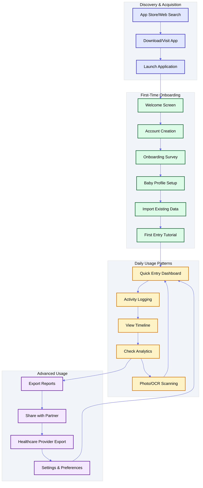

# User Journey & UI Design - Baby Tracker

## 📋 Overview

This document outlines the complete user journey for Baby Tracker, from first-time app discovery through daily usage patterns. It includes UI mockups, onboarding flows, data import strategies, and cold start solutions.

---

## 🎯 Critical User Journeys

### Primary User Personas

#### 1. **New Parent Sarah** (Primary Persona)
- **Age**: 28, first-time mom
- **Tech Comfort**: High (software engineer)
- **Baby Age**: 2 weeks old
- **Current Method**: Handwritten notebook + phone notes
- **Pain Points**: Wants to digitize existing notes, share with partner, track patterns

#### 2. **Experienced Parent Mike** (Secondary Persona)  
- **Age**: 34, second child
- **Tech Comfort**: Medium (marketing manager)
- **Baby Age**: 3 months old
- **Current Method**: Various apps, some spreadsheets
- **Pain Points**: Wants consolidated solution, better analytics

#### 3. **Caregiver Maria** (Tertiary Persona)
- **Age**: 45, professional nanny
- **Tech Comfort**: Low-Medium
- **Context**: Cares for multiple babies
- **Current Method**: Paper logs for parents
- **Pain Points**: Easy logging, clear handoff to parents

---

## 🚀 Complete User Journey Map

### Journey Overview



---

## 📱 UI Mockups & Wireframes

### 1. Welcome & Onboarding Flow

#### Welcome Screen (Mobile)
```
┌─────────────────────────────────────┐
│  ◀ [Skip]                    [Help] │
│                                     │
│           🍼                        │
│      Baby Tracker                   │
│                                     │
│    Track your baby's journey        │
│      with intelligent AI             │
│                                     │
│  • Easy activity logging            │
│  • Smart photo scanning             │
│  • Beautiful growth insights        │
│  • Works offline anywhere           │
│                                     │
│                                     │
│  ┌─────────────────────────────────┐ │
│  │     Get Started Free            │ │
│  └─────────────────────────────────┘ │
│                                     │
│        Already have an account?     │
│              Sign In                │
└─────────────────────────────────────┘
```

#### Account Creation Flow
```
┌─────────────────────────────────────┐
│  ◀ Back                             │
│                                     │
│        Create Your Account          │
│                                     │
│  ┌─────────────────────────────────┐ │
│  │ 📧 Email Address               │ │
│  │ sarah@example.com              │ │
│  └─────────────────────────────────┘ │
│                                     │
│  ┌─────────────────────────────────┐ │
│  │ 🔒 Password                    │ │
│  │ ••••••••••                     │ │
│  └─────────────────────────────────┘ │
│                                     │
│  ┌─────────────────────────────────┐ │
│  │ 👤 Your Name                   │ │
│  │ Sarah Johnson                  │ │
│  └─────────────────────────────────┘ │
│                                     │
│  ☑ I agree to Terms & Privacy       │
│  ☑ Send me helpful parenting tips   │
│                                     │
│  ┌─────────────────────────────────┐ │
│  │        Create Account           │ │
│  └─────────────────────────────────┘ │
│                                     │
│     Or continue with:               │
│    [Google] [Apple] [Facebook]      │
└─────────────────────────────────────┘
```

### 2. Onboarding Survey

#### Survey Questions Flow
```
┌─────────────────────────────────────┐
│  ◀ Back              Step 1 of 5    │
│                                     │
│     Let's get to know you! 👋       │
│                                     │
│   Are you a:                        │
│                                     │
│  ┌─────────────────────────────────┐ │
│  │ 👩 New Parent (First Baby)      │ │
│  └─────────────────────────────────┘ │
│                                     │
│  ┌─────────────────────────────────┐ │
│  │ 👨 Experienced Parent           │ │
│  └─────────────────────────────────┘ │
│                                     │
│  ┌─────────────────────────────────┐ │
│  │ 👩‍⚕️ Professional Caregiver     │ │
│  └─────────────────────────────────┘ │
│                                     │
│  ┌─────────────────────────────────┐ │
│  │ 👨‍👩‍👧 Family Member/Partner      │ │
│  └─────────────────────────────────┘ │
│                                     │
│                                     │
│            [ Continue ]             │
└─────────────────────────────────────┘

┌─────────────────────────────────────┐
│  ◀ Back              Step 2 of 5    │
│                                     │
│    What matters most to you? 🎯     │
│                                     │
│  ☑ Easy, one-tap logging            │
│  ☑ Detailed analytics & insights    │
│  ☑ Sharing with partner/caregiver   │
│  ☑ Healthcare provider reports      │
│  ☑ Photo scanning of notes          │
│  ☑ Offline reliability              │
│  ☑ Growth tracking & milestones     │
│  ☑ Feeding pattern analysis         │
│                                     │
│     Select all that apply           │
│                                     │
│                                     │
│            [ Continue ]             │
└─────────────────────────────────────┘

┌─────────────────────────────────────┐
│  ◀ Back              Step 3 of 5    │
│                                     │
│   How do you currently track? 📝    │
│                                     │
│  ○ Handwritten notebook/journal     │
│  ○ Phone notes app                  │
│  ○ Spreadsheet (Excel/Sheets)       │
│  ○ Another baby tracking app        │
│  ○ I don't track yet                │
│  ○ Mixed methods                    │
│                                     │
│   [Would you like to import         │
│    existing data later?]            │
│                                     │
│    ☑ Yes, I have data to import     │
│                                     │
│            [ Continue ]             │
└─────────────────────────────────────┘
```

### 3. Baby Profile Setup

#### Baby Information Form
```
┌─────────────────────────────────────┐
│  ◀ Back              Step 4 of 5    │
│                                     │
│      Tell us about your baby 👶     │
│                                     │
│          [Add Photo] 📷             │
│      ┌─────────────────┐            │
│      │                 │            │
│      │       👶        │            │
│      │                 │            │
│      └─────────────────┘            │
│                                     │
│  ┌─────────────────────────────────┐ │
│  │ 👤 Baby's Name                 │ │
│  │ Emma Johnson                   │ │
│  └─────────────────────────────────┘ │
│                                     │
│  Birth Date: 📅                     │
│  ┌───────┬───────┬─────────────────┐ │
│  │ Month │ Day   │ Year            │ │
│  │ Dec ▼ │ 15 ▼  │ 2024 ▼          │ │
│  └───────┴───────┴─────────────────┘ │
│                                     │
│  Gender: ○ Girl  ○ Boy  ○ Other     │
│                                     │
│            [ Continue ]             │
└─────────────────────────────────────┘
```

### 4. Data Import Options

#### Import Strategy Selection
```
┌─────────────────────────────────────┐
│  ◀ Back              Step 5 of 5    │
│                                     │
│    Import Existing Data? 📊         │
│                                     │
│  ┌─────────────────────────────────┐ │
│  │ 📷 Scan Handwritten Notes       │ │
│  │ Use AI to convert photos to     │ │
│  │ digital entries                 │ │
│  └─────────────────────────────────┘ │
│                                     │
│  ┌─────────────────────────────────┐ │
│  │ 📋 Upload Spreadsheet           │ │
│  │ Import CSV/Excel files          │ │
│  │ (.csv, .xlsx formats)           │ │
│  └─────────────────────────────────┘ │
│                                     │
│  ┌─────────────────────────────────┐ │
│  │ ⌨️  Type Previous Entries        │ │
│  │ Manually add historical data    │ │
│  │ with smart date suggestions     │ │
│  └─────────────────────────────────┘ │
│                                     │
│  ┌─────────────────────────────────┐ │
│  │ 🚀 Start Fresh                  │ │
│  │ Begin tracking from today       │ │
│  └─────────────────────────────────┘ │
└─────────────────────────────────────┘
```

---

## 📊 Cold Start Solutions

### Problem: New Users Need Immediate Value

#### Solution 1: Sample Data & Demo Mode
```
┌─────────────────────────────────────┐
│               Welcome! 👋            │
│                                     │
│    Want to explore before you       │
│         start tracking?             │
│                                     │
│  ┌─────────────────────────────────┐ │
│  │ 👀 Try Demo Mode                │ │
│  │ See how Baby Tracker works      │ │
│  │ with sample baby "Alex"         │ │
│  └─────────────────────────────────┘ │
│                                     │
│  ┌─────────────────────────────────┐ │
│  │ 🚀 Start My Baby's Journey      │ │
│  │ Begin tracking immediately      │ │
│  │ with your real data            │ │
│  └─────────────────────────────────┘ │
│                                     │
│      You can always switch modes    │
│           later in settings         │
└─────────────────────────────────────┘
```

#### Solution 2: Guided First Entry
```
┌─────────────────────────────────────┐
│          Your First Entry! 🎉       │
│                                     │
│   Let's log what's happening now:   │
│                                     │
│  What did Emma just do?             │
│                                     │
│  ┌─────────────────────────────────┐ │
│  │ 🍼 Had a Feeding                │ │
│  │ Breast, bottle, or solid food   │ │
│  └─────────────────────────────────┘ │
│                                     │
│  ┌─────────────────────────────────┐ │
│  │ 💤 Went to Sleep                │ │
│  │ Track sleep session             │ │
│  └─────────────────────────────────┘ │
│                                     │
│  ┌─────────────────────────────────┐ │
│  │ 🚼 Diaper Change                │ │
│  │ Wet, dirty, or both             │ │
│  └─────────────────────────────────┘ │
│                                     │
│  ┌─────────────────────────────────┐ │
│  │ 🎈 Other Activity               │ │
│  │ Playtime, tummy time, etc.      │ │
│  └─────────────────────────────────┘ │
└─────────────────────────────────────┘
```

---

## 🔄 Data Import Workflows

### 1. Handwritten Notes Scanning

#### OCR Import Flow
```
┌─────────────────────────────────────┐
│  ◀ Back         Scan Your Notes     │
│                                     │
│     📷 Camera View                  │
│  ┌─────────────────────────────────┐ │
│  │                                 │ │
│  │   [Live camera preview]         │ │
│  │                                 │ │
│  │   ┌─────────────────────────┐   │ │
│  │   │  Focus on text clearly  │   │ │
│  │   │  Ensure good lighting   │   │ │
│  │   └─────────────────────────┘   │ │
│  │                                 │ │
│  └─────────────────────────────────┘ │
│                                     │
│    [📷 Capture] [🖼️ Gallery] [💡 Tips] │
│                                     │
│  Pro Tips:                          │
│  • Use natural lighting             │
│  • Keep text flat and straight      │
│  • One page at a time works best    │
└─────────────────────────────────────┘

┌─────────────────────────────────────┐
│  ◀ Back         Processing... 🔄    │
│                                     │
│   ┌─────────────────────────────┐   │
│   │     [Scanned image]         │   │
│   │                             │   │
│   │  Dec 15: Fed 4oz at 10am    │   │
│   │  Diaper change 11:30am      │   │
│   │  Nap 2pm-4pm                │   │
│   │  Fed 3oz at 5pm             │   │
│   └─────────────────────────────┘   │
│                                     │
│   🤖 AI is reading your notes...    │
│                                     │
│   ▓▓▓▓▓▓▓▓░░ 80%                   │
│                                     │
│   Found 4 activities to import      │
│                                     │
│   [Cancel Processing]               │
└─────────────────────────────────────┘

┌─────────────────────────────────────┐
│  ◀ Back        Review & Confirm     │
│                                     │
│   We found these activities:        │
│                                     │
│  ✓ 🍼 Feeding - Dec 15, 10:00am     │
│    Formula, 4 fl oz                 │
│    [Edit] [Delete]                  │
│                                     │
│  ✓ 🚼 Diaper Change - Dec 15, 11:30am│
│    Type: Wet                        │
│    [Edit] [Delete]                  │
│                                     │
│  ✓ 💤 Sleep - Dec 15, 2:00pm        │
│    Duration: 2h 0m                  │
│    [Edit] [Delete]                  │
│                                     │
│  ✓ 🍼 Feeding - Dec 15, 5:00pm      │
│    Formula, 3 fl oz                 │
│    [Edit] [Delete]                  │
│                                     │
│  ┌─────────────────────────────────┐ │
│  │      Import All (4)             │ │
│  └─────────────────────────────────┘ │
│                                     │
│    [Scan Another Page]              │
└─────────────────────────────────────┘
```

### 2. Spreadsheet Import

#### CSV/Excel Upload Flow
```
┌─────────────────────────────────────┐
│  ◀ Back       Import Spreadsheet    │
│                                     │
│  Supported formats:                 │
│  • Excel (.xlsx, .xls)              │
│  • CSV (.csv)                       │
│  • Google Sheets (exported)         │
│                                     │
│  ┌─────────────────────────────────┐ │
│  │     📄 Choose File              │ │
│  └─────────────────────────────────┘ │
│                                     │
│  Or drag and drop your file here    │
│                                     │
│  ┌ ─ ─ ─ ─ ─ ─ ─ ─ ─ ─ ─ ─ ─ ─ ─ ┐ │
│  │                                 │ │
│  │     Drop your file here 📁      │ │
│  │                                 │ │
│  └ ─ ─ ─ ─ ─ ─ ─ ─ ─ ─ ─ ─ ─ ─ ─ ┘ │
│                                     │
│  Sample format:                     │
│  Date, Time, Type, Amount, Notes    │
│  12/15, 10:00, Feeding, 4oz, ...   │
│                                     │
│  [📥 Download Template]             │
└─────────────────────────────────────┘

┌─────────────────────────────────────┐
│  ◀ Back        Map Your Columns     │
│                                     │
│   📄 baby_log.csv (24 rows)         │
│                                     │
│   Map your columns to our fields:   │
│                                     │
│  Your Column    →  Our Field        │
│  ─────────────────────────────────  │
│  Date           →  📅 Date          │
│  Time           →  🕐 Time          │
│  Activity       →  📝 Type          │
│  Amount         →  🍼 Amount        │
│  Notes          →  📋 Notes         │
│                                     │
│  Preview:                           │
│  ┌─────────────────────────────────┐ │
│  │ 12/15 10:00 Feeding 4oz ...     │ │
│  │ 12/15 11:30 Diaper Wet ...      │ │
│  │ 12/15 14:00 Sleep 2hrs ...      │ │
│  └─────────────────────────────────┘ │
│                                     │
│  ┌─────────────────────────────────┐ │
│  │     Import 24 Records           │ │
│  └─────────────────────────────────┘ │
└─────────────────────────────────────┘
```

---

## 📱 Main Dashboard & Daily Usage

### Dashboard Overview (Mobile)
```
┌─────────────────────────────────────┐
│  👤 Sarah      🔔     ⚙️     📊     │
│                                     │
│     Emma (2 weeks old) 👶           │
│     Last fed 2h 15m ago             │
│                                     │
│  ┌─────────────────────────────────┐ │
│  │           Quick Actions          │ │
│  │                                 │ │
│  │  🍼      💤      🚼      🎈      │ │
│  │ Feed    Sleep   Diaper Activity │ │
│  │                                 │ │
│  │        📷 Scan Notes            │ │
│  └─────────────────────────────────┘ │
│                                     │
│         Today's Summary             │
│  ┌─────────────────────────────────┐ │
│  │ 🍼 6 feedings  💤 3 naps        │ │
│  │ 🚼 8 diapers   😊 Happy mood    │ │
│  └─────────────────────────────────┘ │
│                                     │
│         Recent Activities           │
│  ┌─────────────────────────────────┐ │
│  │ 2:30 PM  🍼  Formula 4oz        │ │
│  │ 1:45 PM  🚼  Diaper change      │ │
│  │ 12:30 PM 💤  Nap (45 min)       │ │
│  │ 11:15 AM 🍼  Breastfeed (L)     │ │
│  └─────────────────────────────────┘ │
│                                     │
│ ─────── [🏠] [📊] [👶] [⚙️] ──────── │
└─────────────────────────────────────┘
```

### Quick Entry Flow
```
┌─────────────────────────────────────┐
│  ◀ Back           Feeding 🍼        │
│                                     │
│  What type of feeding?              │
│                                     │
│  ┌─────────────────────────────────┐ │
│  │ 🤱 Breastfeeding                │ │
│  └─────────────────────────────────┘ │
│  ┌─────────────────────────────────┐ │
│  │ 🍼 Bottle (Formula/Pumped)      │ │
│  └─────────────────────────────────┘ │
│  ┌─────────────────────────────────┐ │
│  │ 🥄 Solid Food                   │ │
│  └─────────────────────────────────┘ │
│                                     │
│                                     │
│                                     │
│                                     │
│                                     │
│                                     │
│                                     │
│                                     │
│                                     │
└─────────────────────────────────────┘

┌─────────────────────────────────────┐
│  ◀ Back        Bottle Feeding 🍼    │
│                                     │
│  When: 📅 Dec 15  🕐 2:30 PM        │
│  [Edit Time]                        │
│                                     │
│  Amount:                            │
│  ┌─────────────────────────────────┐ │
│  │        4         fl oz ▼        │ │
│  │    ─   ●   +                    │ │
│  └─────────────────────────────────┘ │
│                                     │
│  Formula type:                      │
│  ○ Similac Pro-Advance              │
│  ○ Enfamil NeuroPro                 │
│  ● Other: Kirkland                  │
│                                     │
│  Temperature: ○ Room  ● Warm ○ Cold │
│                                     │
│  Notes (optional):                  │
│  ┌─────────────────────────────────┐ │
│  │ Emma seemed extra hungry        │ │
│  └─────────────────────────────────┘ │
│                                     │
│  ┌─────────────────────────────────┐ │
│  │        Save Entry               │ │
│  └─────────────────────────────────┘ │
└─────────────────────────────────────┘
```

### Natural Language Entry
```
┌─────────────────────────────────────┐
│  ◀ Back        Smart Entry ✨       │
│                                     │
│    Just type what happened!         │
│                                     │
│  ┌─────────────────────────────────┐ │
│  │ Fed Emma 4oz formula at 2:30pm  │ │
│  │ She was fussy before            │ │
│  │                                 │ │
│  └─────────────────────────────────┘ │
│                                     │
│  🤖 I understood:                   │
│                                     │
│  📅 Date: Today (Dec 15)            │
│  🕐 Time: 2:30 PM                   │
│  🍼 Type: Formula feeding            │
│  📏 Amount: 4 fl oz                 │
│  📝 Notes: "She was fussy before"   │
│                                     │
│  ┌─────────────────────────────────┐ │
│  │        Save Entry               │ │
│  └─────────────────────────────────┘ │
│                                     │
│  [🎤 Voice Input]  [Edit Details]   │
│                                     │
│  Try: "Changed diaper at 3pm" or    │
│       "Emma slept from 1-3pm"       │
└─────────────────────────────────────┘
```

---

## 🌐 Web Application Flow

### Web Dashboard (Desktop)
```
┌────────────────────────────────────────────────────────────────────┐
│ Baby Tracker    👤 Sarah J.  🔔  ⚙️  📊 Analytics  🏥 Export      │
├────────────────────────────────────────────────────────────────────┤
│                                                                    │
│ 👶 Emma Johnson (2 weeks old)        📅 December 15, 2024         │
│                                                                    │
│ ┌──────────────┐ ┌──────────────────────────────────────────────┐ │
│ │ Quick Entry  │ │              Today's Timeline                │ │
│ │              │ │                                              │ │
│ │  🍼 Feed     │ │ 2:30 PM  🍼 Formula 4oz                     │ │
│ │              │ │ 1:45 PM  🚼 Diaper change (wet)              │ │
│ │  💤 Sleep    │ │ 12:30 PM 💤 Nap started                      │ │
│ │              │ │ 1:15 PM  💤 Nap ended (45 min)              │ │
│ │  🚼 Diaper   │ │ 11:15 AM 🍼 Breastfeed (left, 15 min)       │ │
│ │              │ │ 10:30 AM 🚼 Diaper change (dirty)           │ │
│ │  🎈 Activity │ │ 9:45 AM  🍼 Formula 3oz                      │ │
│ │              │ │ 8:30 AM  🚼 Diaper change (wet)              │ │
│ │  📷 Scan     │ │                                              │ │
│ │              │ │ [Load More Activities]                       │ │
│ └──────────────┘ └──────────────────────────────────────────────┘ │
│                                                                    │
│ ┌──────────────────────────────────┐ ┌────────────────────────────┐ │
│ │         Today's Summary           │ │     This Week's Insights   │ │
│ │                                  │ │                            │ │
│ │ 🍼 Feedings: 6 (avg 3.5oz)       │ │ 📊 Feeding trends ↗        │ │
│ │ 💤 Sleep: 12h 30m (3 sessions)   │ │ 💤 Sleep improving ↗       │ │  
│ │ 🚼 Diapers: 8 (6 wet, 2 dirty)   │ │ 🚼 Normal patterns ✓       │ │
│ │ 🎈 Activities: 2                 │ │ ⚖️ Growth on track ✓       │ │
│ │                                  │ │                            │ │
│ │ Last feeding: 2h 15m ago         │ │ [View Full Analytics]      │ │
│ └──────────────────────────────────┘ └────────────────────────────┘ │
└────────────────────────────────────────────────────────────────────┘
```

---

## 📊 User Feedback Collection

### Onboarding Survey Questions

#### Core Demographics & Context
```yaml
survey_questions:
  personal_info:
    - question: "What's your role with the baby?"
      type: "single_choice"
      options:
        - "New parent (first baby)"
        - "Experienced parent (2+ babies)"
        - "Professional caregiver/nanny"
        - "Family member (grandparent, partner, etc.)"
        - "Other"

    - question: "How old is your baby?"
      type: "single_choice"
      options:
        - "Newborn (0-4 weeks)"
        - "Young infant (1-3 months)"
        - "Older infant (3-6 months)"
        - "Mobile baby (6+ months)"
        - "I care for multiple babies"

  current_methods:
    - question: "How do you currently track baby activities?"
      type: "multiple_choice"
      options:
        - "Handwritten notebook/journal"
        - "Phone notes app"
        - "Excel/Google Sheets"
        - "Another baby tracking app"
        - "Memory only"
        - "I don't track currently"

    - question: "Do you have existing data you'd like to import?"
      type: "single_choice"
      options:
        - "Yes - handwritten notes/journal"
        - "Yes - digital spreadsheet"
        - "Yes - from another app"
        - "No - starting fresh"

  priorities:
    - question: "What features matter most to you? (Select all)"
      type: "multiple_choice"
      options:
        - "Quick, one-tap entry"
        - "Detailed analytics and insights"
        - "Sharing with partner/family"
        - "Healthcare provider reports"
        - "Photo scanning of written notes"
        - "Offline reliability"
        - "Growth and milestone tracking"
        - "Feeding pattern analysis"
        - "Sleep optimization insights"

  preferences:
    - question: "What measurement units do you prefer?"
      type: "single_choice"
      options:
        - "US Imperial (oz, lbs, inches)"
        - "Metric (ml, kg, cm)"

    - question: "What's your timezone?"
      type: "dropdown"
      options: ["Auto-detect from device", "Manual selection"]

    - question: "How often do you plan to use Baby Tracker?"
      type: "single_choice"
      options:
        - "Multiple times daily"
        - "Once daily for summary"
        - "Few times per week"
        - "As needed"
```

### In-App Micro-Surveys
```yaml
micro_surveys:
  first_entry_complete:
    question: "How was your first entry experience?"
    type: "rating_with_comment"
    scale: 5
    followup: "What would make it even better?"

  after_ocr_scan:
    question: "How accurate was our scanning?"
    type: "rating_with_comment"
    scale: 5
    followup: "What did we miss or get wrong?"

  weekly_usage:
    question: "What's your favorite feature so far?"
    type: "multiple_choice"
    options:
      - "Quick entry buttons"
      - "Timeline view"
      - "Analytics dashboard"
      - "Photo scanning"
      - "Natural language entry"
      - "Offline sync"

  export_usage:
    question: "Who did you share this report with?"
    type: "multiple_choice"
    options:
      - "Pediatrician/doctor"
      - "Partner/spouse"
      - "Family member"
      - "Childcare provider"
      - "Personal records"
```

---

## 🎯 Conversion Optimization

### Critical Conversion Points

#### 1. App Store to Download (Acquisition)
- **Compelling screenshots** showing key features
- **Clear value proposition** in app description
- **Social proof** with ratings and reviews
- **App preview video** demonstrating core flows

#### 2. Download to Account Creation (Activation)
- **Skip option** for quick exploration
- **Demo mode** to show immediate value
- **Social login** options (Google, Apple, Facebook)
- **Progressive profiling** - collect info gradually

#### 3. Account Creation to First Entry (Onboarding)
- **Clear progress indicators** (Step 1 of 5)
- **Skip complex setup** options
- **Immediate value** with sample data/demo
- **Guided first entry** with helpful prompts

#### 4. First Entry to Daily Habit (Retention)
- **Smart reminders** based on feeding patterns
- **Quick entry shortcuts** (widgets, shortcuts)
- **Streak tracking** and positive reinforcement
- **Partner sharing** to increase engagement

### A/B Test Opportunities
```yaml
ab_tests:
  onboarding_length:
    variant_a: "5-step detailed onboarding"
    variant_b: "2-step minimal onboarding"
    metric: "completion_rate"

  first_entry_flow:
    variant_a: "Guided step-by-step tutorial"
    variant_b: "Smart suggestions with tips"
    metric: "first_entry_completion"

  dashboard_layout:
    variant_a: "Timeline-focused layout"
    variant_b: "Quick actions prominent"
    metric: "daily_active_usage"

  import_positioning:
    variant_a: "Import offered in onboarding"
    variant_b: "Import offered after first entry"
    metric: "import_usage_rate"
```

---

## 🔄 Error States & Edge Cases

### Common Error Scenarios

#### Network Connectivity Issues
```
┌─────────────────────────────────────┐
│           Offline Mode 📶           │
│                                     │
│     You're currently offline        │
│                                     │
│  ✓ Your entry has been saved        │
│    locally and will sync when       │
│    you're back online               │
│                                     │
│  📱 You can continue logging:       │
│  • Feeding sessions                 │
│  • Diaper changes                   │
│  • Sleep tracking                   │
│  • Activities & notes               │
│                                     │
│  ⏳ Waiting to sync: 3 entries      │
│                                     │
│  🔄 We'll automatically sync when   │
│     connection is restored          │
│                                     │
│            [ Continue ]             │
└─────────────────────────────────────┘
```

#### OCR Processing Failures
```
┌─────────────────────────────────────┐
│         Scanning Issue 📷           │
│                                     │
│   Hmm, we had trouble reading       │
│        your handwriting             │
│                                     │
│  Here's what might help:            │
│  • Better lighting                  │
│  • Flatter page angle               │
│  • Clearer handwriting area         │
│                                     │
│  ┌─────────────────────────────────┐ │
│  │        Try Again                │ │
│  └─────────────────────────────────┘ │
│                                     │
│  ┌─────────────────────────────────┐ │
│  │     Type Instead                │ │
│  └─────────────────────────────────┘ │
│                                     │
│  Or we can help you add entries     │
│  manually - it's just as fast!      │
└─────────────────────────────────────┘
```

#### Data Sync Conflicts
```
┌─────────────────────────────────────┐
│         Sync Conflict ⚠️            │
│                                     │
│   We found conflicting entries      │
│        that need your input         │
│                                     │
│  📱 Your phone: Fed 4oz at 2:30pm   │
│  🌐 Web app:    Fed 3oz at 2:25pm   │
│                                     │
│  Which entry is correct?            │
│                                     │
│  ┌─────────────────────────────────┐ │
│  │ 📱 Keep Phone Version (4oz)     │ │
│  └─────────────────────────────────┘ │
│                                     │
│  ┌─────────────────────────────────┐ │
│  │ 🌐 Keep Web Version (3oz)       │ │
│  └─────────────────────────────────┘ │
│                                     │
│  ┌─────────────────────────────────┐ │
│  │ ✏️ Edit & Merge                 │ │
│  └─────────────────────────────────┘ │
│                                     │
│  [Skip This Time] [Auto-Resolve]    │
└─────────────────────────────────────┘
```

---

## 📈 Success Metrics & Analytics

### User Journey Conversion Funnel
```
App Store Visit        100%    (1000 users)
    ↓
App Download           30%     (300 users)
    ↓  
App Launch            85%     (255 users)
    ↓
Account Creation      70%     (178 users)
    ↓
Onboarding Complete   80%     (142 users)
    ↓
First Entry          90%     (128 users)
    ↓
Day 2 Return         60%     (77 users)
    ↓
Day 7 Return         45%     (58 users)
    ↓
Day 30 Active        30%     (38 users)
```

### Feature Adoption Tracking
```yaml
analytics_events:
  onboarding:
    - "onboarding_started"
    - "onboarding_step_completed" (with step_number)
    - "onboarding_abandoned" (with last_step)
    - "onboarding_completed"

  data_entry:
    - "entry_created" (with type: feeding/diaper/sleep/activity)
    - "entry_method" (manual/ocr/nlp/voice)
    - "entry_time_to_complete"
    - "quick_action_used"

  feature_usage:
    - "timeline_viewed"
    - "analytics_viewed"
    - "ocr_scan_attempted"
    - "nlp_entry_attempted"
    - "data_exported"
    - "sharing_initiated"

  engagement:
    - "daily_session_length"
    - "entries_per_session"
    - "feature_discovery"
    - "help_article_viewed"
```

This comprehensive user journey document provides the complete roadmap for creating an intuitive, value-driven first-time user experience that addresses cold start challenges and provides multiple pathways for users to begin tracking their baby's activities successfully.

<function_calls>
<invoke name="todo_write">
<parameter name="merge">true
